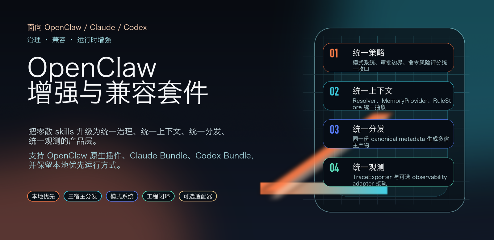
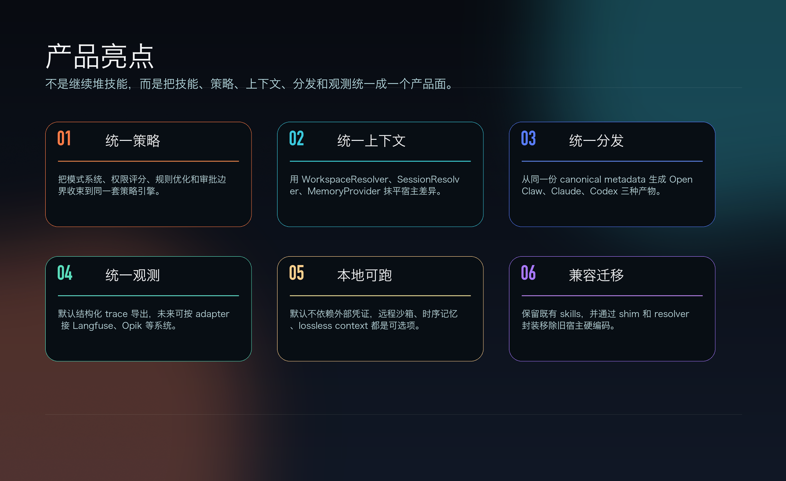
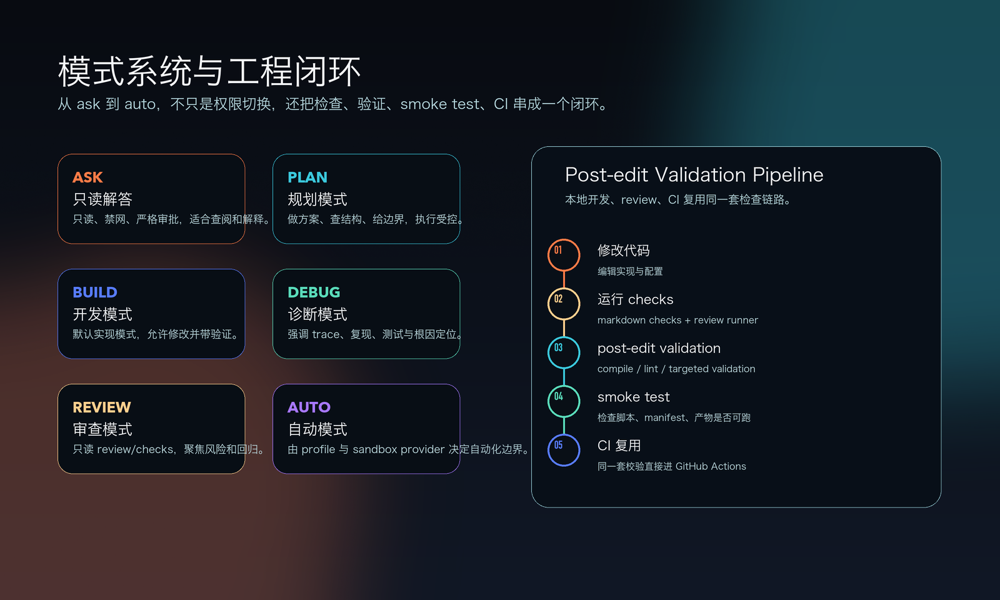
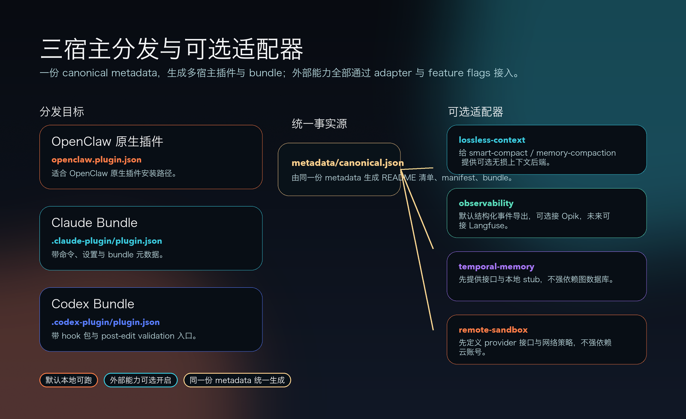

# OpenClaw Enhancement & Compatibility Kit

<p align="center">
  
</p>

<p align="center">
  A governance, compatibility, and runtime enhancement layer for OpenClaw / Claude / Codex.
</p>

<p align="center">
  <a href="README.md">简体中文</a> ·
  <a href="README_EN.md">English</a> ·
  <a href="docs/ARCHITECTURE.md">Architecture</a> ·
  <a href="docs/MIGRATION.md">Migration</a> ·
  <a href="docs/AUDIT.md">Audit</a>
</p>

OECK upgrades a loose skills repository into a product surface with unified policy, unified context, unified distribution, unified observability, and local-first execution.

## What It Does

- Keeps `skills/` as content assets instead of throwing them away.
- Adds a runtime core around policy, context, session, workspace, memory, rules, sandboxing, and tracing.
- Generates OpenClaw, Claude, and Codex distribution assets from one canonical metadata source.
- Reuses the same checks, post-edit validation, smoke tests, and CI path for local development and automation.

## Product Story

<p align="center">
  
</p>

<p align="center">
  
</p>

<p align="center">
  
</p>

## Quick Start

```bash
python3 tools/generate_banner.py
python3 tools/sync_repo_state.py
python3 tools/run_checks.py --all
python3 tools/post_edit_validate.py
python3 tools/smoke_test.py
```

## Docs

- [Chinese primary overview](README.md)
- [Chinese alias page](README_CN.md)
- [Architecture](docs/ARCHITECTURE.md)
- [Migration](docs/MIGRATION.md)
- [Audit](docs/AUDIT.md)
- [LLM index](llms.txt)

## Generated Inventory

<details>
<summary>Skills</summary>

<!-- generated-skills:start -->
- `behavior-analyzer`: Session health analysis and anomaly detection.
- `cache-monitor`: Static and dynamic prompt layer cache drift monitoring.
- `compact-guardian`: Circuit breaker and recovery flow for failed compactions.
- `evolve`: Rule extraction from reflections and learnings.
- `fusion-engine`: Multi-source context fusion for decision support.
- `knowledge-federation`: Rule sharing, federation, and long-term optimization.
- `memory-compaction`: Memory pruning, merging, and optional lossless backends.
- `rule-optimizer`: Effectiveness scoring and A/B rule refinement.
- `safe-command-execution`: AST-based shell command inspection.
- `self-eval`: Reflection capture and learnings persistence.
- `smart-compact`: Session compaction strategy and transcript rewriting.
- `yolo-permissions`: Command risk scoring and permission classification.
<!-- generated-skills:end -->

</details>

<details>
<summary>Adapters</summary>

<!-- generated-adapters:start -->
- `openclaw-native`: Native OpenClaw plugin metadata and bundle output.
- `claude-bundle`: Claude-compatible bundle manifest and command roots.
- `codex-bundle`: Codex-compatible bundle manifest and hook packs.
- `lossless-context`: Optional context preservation backend for compaction workflows.
- `observability`: Structured event exporter with optional Opik/Langfuse bridges.
- `temporal-memory`: Optional temporal memory interface with local stub implementation.
- `remote-sandbox`: Optional remote sandbox provider interface.
<!-- generated-adapters:end -->

</details>

<details>
<summary>Tests</summary>

<!-- generated-tests:start -->
- `skills/behavior-analyzer/tests/test_behavior_analyzer.py`: 10
- `skills/fusion-engine/tests/test_fusion_engine.py`: 17
- `skills/knowledge-federation/tests/test_central_api.py`: 15
- `skills/knowledge-federation/tests/test_hook_integration.py`: 10
- `skills/knowledge-federation/tests/test_knowledge_federation.py`: 29
- `skills/knowledge-federation/tests/test_long_term_evolution.py`: 17
- `skills/knowledge-federation/tests/test_rule_recommender.py`: 20
- `skills/rule-optimizer/tests/test_rule_optimizer.py`: 9
- `tests/distribution/test_sync_repo_state.py`: 2
- `tests/runtime_core/test_policy_engine.py`: 2
- `tests/runtime_core/test_validation.py`: 2
- `tests/runtime_core/test_workspace_resolver.py`: 2
- `tests/smoke/test_tools_smoke.py`: 1
- `tests/test_bash_guard.py`: 33
- `tests/test_evolve.py`: 11
- `tests/test_learnings_extractor.py`: 8
- `tests/test_permission_scorer.py`: 9
- `tests/test_recovery_manager.py`: 6
- `tests/test_self_eval.py`: 16
- `tests/test_yolo_classifier.py`: 20
- `tests/test_health_check.sh`: 1
<!-- generated-tests:end -->

</details>

<details>
<summary>Repository Layout</summary>

<!-- generated-tree:start -->
- `metadata/`
  - `metadata/canonical.json`
- `oeck/`
  - `oeck/__init__.py`
  - `oeck/adapters`
  - `oeck/distribution`
  - `oeck/runtime_core`
- `skills/`
  - `skills/__init__.py`
  - `skills/behavior-analyzer`
  - `skills/cache-monitor`
  - `skills/compact-guardian`
  - `skills/evolve`
  - `skills/fusion-engine`
  - `skills/knowledge-federation`
  - `skills/memory-compaction`
  - `skills/rule-optimizer`
  - `skills/safe-command-execution`
  - `skills/self-eval`
  - `skills/shared`
  - `skills/smart-compact`
  - `skills/yolo-permissions`
- `docs/`
  - `docs/01-architecture.md`
  - `docs/02-prompt-engineering.md`
  - `docs/03-memory-system.md`
  - `docs/04-session-hooks.md`
  - `docs/ARCHITECTURE.md`
  - `docs/AUDIT.md`
  - `docs/MIGRATION.md`
  - `docs/assets`
  - `docs/generated`
- `.openclaw/`
  - `.openclaw/checks`
- `.claude-plugin/`
  - `.claude-plugin/commands`
  - `.claude-plugin/plugin.json`
  - `.claude-plugin/settings.json`
- `.codex-plugin/`
  - `.codex-plugin/hooks`
  - `.codex-plugin/plugin.json`
- `plugins/`
  - `plugins/openclaw-native`
- `tests/`
  - `tests/__init__.py`
  - `tests/conftest.py`
  - `tests/distribution`
  - `tests/runtime_core`
  - `tests/smoke`
  - `tests/test_bash_guard.py`
  - `tests/test_evolve.py`
  - `tests/test_health_check.sh`
  - `tests/test_learnings_extractor.py`
  - `tests/test_permission_scorer.py`
  - `tests/test_recovery_manager.py`
  - `tests/test_self_eval.py`
  - `tests/test_yolo_classifier.py`
- `tools/`
  - `tools/generate_banner.py`
  - `tools/health_check.sh`
  - `tools/health_check_config.json`
  - `tools/post_edit_validate.py`
  - `tools/repo_map.py`
  - `tools/run_checks.py`
  - `tools/smoke_test.py`
  - `tools/sync_repo_state.py`
- `.github/`
  - `.github/workflows`
<!-- generated-tree:end -->

</details>
